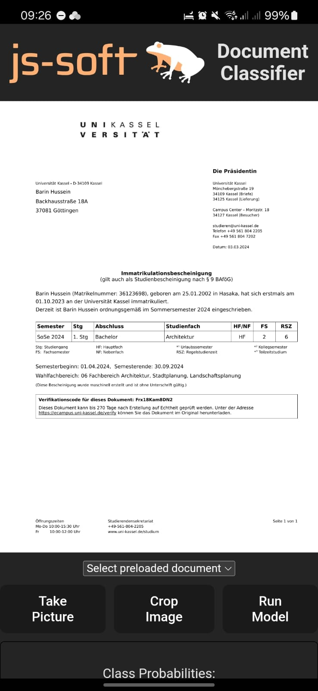

## j&s Demo Apps

### Document Classifier

This app demonstrates how to build a cross-platform document classifier app using React, Capacitor and ONNX.

- [Readme](./classifier-app/README.md)
- [Source Code](./classifier-app)

### PyScript Demo

This app demonstrates how to build a cross-platform document classifier app using PyScript.

- [Readme](./pyscript-demo/README.md)
- [Source Code](./pyscript-demo)
