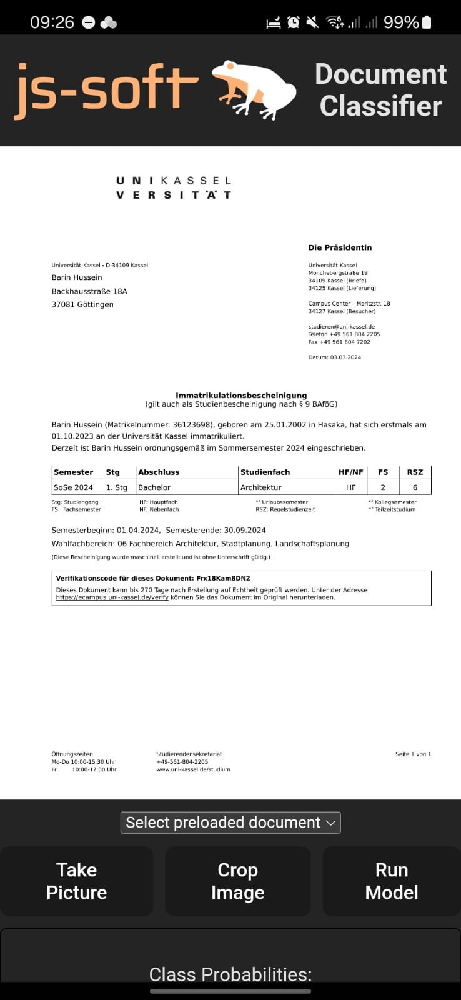

# j&s Demo App: Document Classifier

This is a demo app for the j&s project. It is a document classifier that uses a pre-trained model to classify documents into different categories.

Currently, the app has the following features:
- Camera: Take a picture of a document
- Cropping: Crop the image to the document
- OCR: Extract text from the image
- Classification: Classify the document into one of the following categories:
  - Invoice
  - Certificate
  - Immatriculatio

## Technology Stack
- React: User Interface 
- Vite: Build tool
- Capacitor: Bundling of web app into an android app (+ native features e.g. camera)
- ONNX: Model format for executing the pre-trained model
- Tesseract.js: OCR library for web

## How showcase the app in the browser

1. Run `npm install` to install the dependencies
2. Run `npm run dev` to start the app
3. Open the app in the browser by navigating to `http://localhost:5173`

## How to build and run the app on an android device

1. Install android studio
2. Run `npm install` to install the dependencies
3. Run `npm run build` to build the app
4. Run `npx cap sync` to sync the app with the android studio project
5. Open the folder `android` in android studio
6. Connect your android device to the computer or start an emulator
7. Run the app by clicking the run button

## How to debug the app on an android device

1. Open chrome broswer at `chrome://inspect#devices`
2. Select the device and click "Inspect"
3. Open the console tab to see the logs
